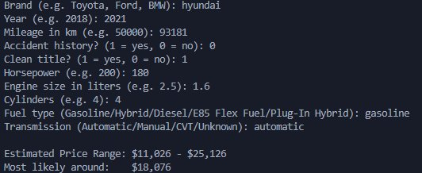

# CarPriced — Used Car Price Prediction

Built this to actually understand how machine learning works — not by watching tutorials, but by breaking things and figuring out why.

This project went through two full versions. Version 1 failed completely. Version 2 works. The failure was the most important part.

---

## The Problem

Can a machine learning model predict the price of a used car given its specs — brand, year, mileage, engine, transmission, and accident history?

---

## Version 1 — Why It Failed

I used the first dataset I found on Kaggle (`nalisha/car-price-prediction-dataset`, 2,500 records). I built the pipeline, trained a Random Forest, and got an R² of **-0.103**.

Instead of assuming my code was wrong, I checked the data first:

| Feature | Correlation with Price | What It Means |
|---------|----------------------|---------------|
| Year | -0.035 | Basically zero |
| Mileage | -0.010 | Basically zero |
| Engine Size | -0.013 | Basically zero |

A 2023 BMW with 10,000 miles had the same chance of being $5,000 as $50,000. The dataset had randomly generated prices — no real patterns existed. **No model can learn patterns that don't exist.**

Lesson: look at your data before building anything.

---

## Version 2 — The Rebuild

Switched to a real dataset of US used car listings (`taeefnajib/used-car-price-prediction-dataset`, 4,009 records) with actual market prices.

---

## Data Cleaning — The Why Behind Each Decision

### Price and Mileage were stored as strings
The raw data had prices like `"$10,300"` and mileage like `"51,000 mi."`. I stripped the symbols and converted them to integers **because machine learning models only understand numbers — keeping them as strings would cause errors or be treated as meaningless categories.**

### The engine column was one messy string
Raw values looked like `"300.0HP 3.7L V6 Cylinder Engine Gasoline Fuel"`. Instead of dropping the column or using it as a text category, I used **regex to extract three separate numeric features — horsepower, engine size in liters, and cylinder count — because a model fed the raw string can't learn that 300HP correlates with higher prices, but a model fed the number 300 can.**

```python
df['horsepower'] = df['engine'].str.extract(r'(\d+\.?\d*)HP').astype(float)
df['liters']     = df['engine'].str.extract(r'(\d+\.?\d*)\s*[Ll](?:iter)?').astype(float)
df['cylinders']  = df['engine'].str.extract(r'(\d+) Cylinder').astype(float)
```

### Missing engine values — filled with median, not mean
After extraction, horsepower had 808 missing values (~20%). I filled them with the **median instead of the mean because car HP has outliers — exotic cars with 600-800HP would drag the mean up and give an unrealistic fill value. The median is the actual middle of the distribution and more representative of a typical car.**

### Missing fuel type — filled with mode
170 fuel type values were missing or junk (`"–"`, `"not supported"`). I replaced junk with NaN first, then filled with the **mode (most frequent value) instead of median, because fuel type is a category, not a number. You can't take the "middle" of Gasoline and Hybrid — but you can say most cars in this dataset run on Gasoline, so assume that.**

### Transmission had 62 unique messy values
Values ranged from `"8-Speed Automatic"` to `"Automatic, 8-Spd PDK Dual-Clutch"` to `"SCHEDULED FOR OR IN PRODUCTION"`. I simplified all 62 into 4 clean categories (Automatic, Manual, CVT, Unknown) **because one-hot encoding 62 transmission variants would create 62 mostly-empty columns that add noise without adding signal. The meaningful distinction is the type, not the exact number of speeds.**

### Dropped model, exterior color, and interior color
The model column had 1,898 unique values. Color columns had 300+. I dropped them **because one-hot encoding thousands of unique categories creates a dimensionality problem — too many columns with mostly zeros slows training and hurts accuracy. Brand already captures most of the price signal that model would add.**

### Used One-Hot Encoding instead of Label Encoding
For brand, fuel type, and transmission I used `pd.get_dummies()` instead of `LabelEncoder()`. **Label Encoding assigns numbers like Audi=0, BMW=1, Ford=2 — which implies Ford is "greater than" Audi. That fake ranking misleads the model. One-Hot Encoding gives each category its own 0/1 column so no false ordering is created.**

### Removed price outliers
The dataset had cars priced up to $2.9 million alongside mostly $10k-$50k cars. I kept only cars between **$3,000 and $200,000 because extreme outliers force the model to account for exotic cars it has almost no examples of — this pulled predictions wildly off for normal cars. Removing them took R² from 0.119 to 0.842 — the single biggest improvement in the entire project.**

---

## Model Selection — The Why Behind Each Choice

I trained three models and compared them rather than guessing which one to use:

| Model | MAE | RMSE | R² |
|-------|-----|------|----|
| Linear Regression | $11,824 | $19,658 | 0.630 |
| Random Forest | $8,107 | $14,593 | 0.796 |
| **XGBoost** | **$7,132** | **$12,828** | **0.842** |

**I started with Linear Regression as a baseline because it's the simplest possible model — if even a straight line gets decent results, the data has real signal. It did (R² 0.63), which confirmed the data was worth using.**

**I used Random Forest because it handles non-linear relationships well — car pricing isn't a straight line. A 2-year-old car doesn't cost exactly twice a 4-year-old car. Random Forest builds many decision trees and averages them, which reduces overfitting.**

**XGBoost won because it builds trees sequentially — each tree learns from the mistakes of the previous one. This makes it especially effective on structured tabular data like car listings.**

---

## Evaluation — The Why Behind Each Metric

I evaluated using three metrics rather than one because each tells a different story:

**MAE (Mean Absolute Error) — $7,132**
I used MAE as the primary metric **because it's interpretable in real-world terms. Being off by $7,132 on average is something anyone can understand. It treats all errors equally.**

**RMSE (Root Mean Squared Error) — $12,828**
I tracked RMSE alongside MAE **because it penalizes large errors more heavily. A model that's off by $30,000 on one car and $1,000 on ten others might look fine by MAE but terrible by RMSE. The gap between MAE and RMSE told me whether the model was making a few catastrophic mistakes or consistent small ones.**

**R² (Coefficient of Determination) — 0.842**
I used R² to understand overall explanatory power **because MAE alone doesn't tell you if the result is good or bad relative to the problem. R² of 0.842 means the model explains 84.2% of the variation in car prices — compared to -0.103 in Version 1 where it explained literally nothing.**

---

## Hyperparameter Tuning

Used GridSearchCV with 5-fold cross validation to test 54 combinations of XGBoost settings (270 total training runs). **I used cross-validation instead of a single train/test split because one split can get lucky or unlucky — CV trains and tests on 5 different data splits and averages the results, giving a more reliable performance estimate.**

Best parameters: `learning_rate: 0.1, max_depth: 5, n_estimators: 300, subsample: 0.8`

Tuning gave marginal improvement (R² 0.825 tuned vs 0.842 default on test set). **This taught me that tuning helps less than data quality — the outlier removal alone was worth 10x more than any parameter adjustment.**

---

## Real World Test

Tested against a real listing on CarGurus:

### 2021 Hyundai Sonata Limited — Listed at $16,827




**Model predicted: $18,076** — off by $1,249. Within our MAE range.

---

## Known Limitations — And Why They Exist

**US market only.** The model was trained on US listings. Philippine market prices follow different patterns due to import taxes, local demand, and depreciation rates. This is called domain shift — the model answers "what would this cost in the US?" not "what would this cost in PH?"

**Brand without model.** Dropping the model column means the model can't distinguish a BMW 1 Series from a BMW M5 — it just sees BMW. A brand tier feature (luxury/premium/budget) would partially fix this without the dimensionality problem.

**Sparse 2024+ data.** The training set has very few 2024 cars so predictions for very new models are less reliable.

---

## What I'd Do Next

1. **Larger dataset first** — 50,000+ records would improve accuracy more than any model change
2. **Add car_age** — `2026 - model_year` is more meaningful to a model than the raw year
3. **Log-transform price** — car prices are right-skewed; training on `log(price)` would treat percentage differences equally
4. **Brand tier feature** — group brands into budget/mid/premium/luxury to capture price signal without 57 one-hot columns

---

## Technologies
Python 3 · Pandas · Scikit-Learn · XGBoost · Matplotlib · Kagglehub · Joblib

---

## About

Started Feb 14, 2026 out of boredom. Rebuilt March 7, 2026 after the first version failed completely and I wanted to understand why.

The model going from R² -0.103 to 0.842 wasn't the achievement. Understanding *why* each step was necessary was.
